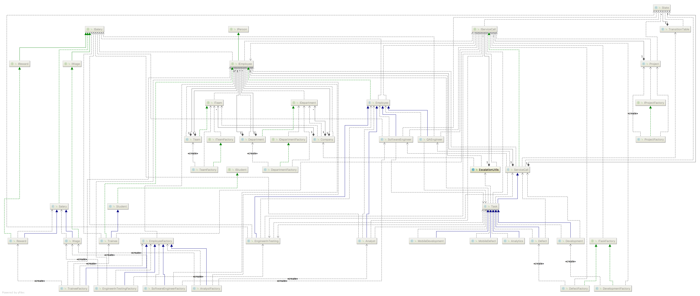

# Business-Process-Simulation
Симуляция процесса разработки продукта в IT компании по Agile &amp; CD

## Описание
Имеются 3 основных составляющих Бизнес-Процесса в компании:
1. Оргструктура (представлена Компанией, Отделами и Командами).
2. Сотрудники.
3. Запросы (Проекты, Запросы и их разновидности (например, Задачи)).

UML диаграммы классов приведены ниже:

[Simple UML Structure](img/uml_structure.png "Упрощенная схема классов проекта")


[Full UML Structure](img/uml_structure.png "Полная схема классов проекта")


### Сотрудники

### Запросы
Запросы - это бизнес-задачи, которые необходимо выполнить. Запросы объединяются в проекты.
Один проект состоит из нескольких запросов и обладает определенным бюджетом.

Задачи - разновидность запросов.

Запросы обладают жизненным циклом и могут переходить из одного состояния в другое (минимальный набор состояний жизненного цикла для запросов: Зарегистрирован и Закрыт).
Для задач набор состояний следующий: Зарегистрирован, В работе, Ручное тестирование, Тест версии, Закрыт.

### Оргструктура
Структура компании обычно древовидная. Компания состоит из отделов, в каждом из котором может работать несколько сотрудников.
Также каждый сотрудник может состоять в 0.* командах, причем предполагается, что команды не вложены друг в друга и не обязательно относятся к одному отделу.

## Бизнес-процессы

Пример консольного вывода программы:

```

Андрей Валунов делает задачу NSDPRD-6442 или исправляет замечания тестирования
На задачу 'NSDPRD-6442' было списано 8 часов (-а). Осталось 16 из 24
Артем Иванов провел РТ задачи NSDPRD-6442 и нашел (-а) замечание (-я).
Василий Петров делает задачу NSDPRD-6442 или исправляет замечания тестирования
На задачу 'NSDPRD-6442' было списано 4 часов (-а). Осталось 12 из 24
Василий Петров делает задачу NSDPRD-6442 или исправляет замечания тестирования
На задачу 'NSDPRD-6442' было списано 10 часов (-а). Осталось 2 из 24
На задачу 'NSDPRD-6442' было списано 4 часов (-а). Осталось 0 из 24
Внимание! На задачу затрачено ТЗТ больше начальной оценки!
Внимание! Руководитель подразделения Департамент ИТ и процессов обслуживания (Андрей Валунов), тимлиды ({
[Релизная группа:Андрей Валунов]
})! Проследите за задачей NSDPRD-6442. Проведите беседу с исполнителем задачи [Артем Иванов]
На задачу 'NSDPRD-6442' было списано 2 часов (-а). Осталось 0 из 24
Внимание! На задачу затрачено ТЗТ больше начальной оценки!
Внимание! Руководитель подразделения Департамент ИТ и процессов обслуживания (Андрей Валунов), тимлиды ({
[Релизная группа:Андрей Валунов]
})! Проследите за задачей NSDPRD-6442. Проведите беседу с исполнителем задачи [Артем Иванов]
Артем Иванов провел РТ задачи NSDPRD-6442 и нашел (-а) замечание (-я).
Василий Петров делает задачу NSDPRD-6442 или исправляет замечания тестирования
На задачу 'NSDPRD-6442' было списано 10 часов (-а). Осталось 0 из 24
Внимание! На задачу затрачено ТЗТ больше начальной оценки!
Внимание! Руководитель подразделения Департамент ИТ и процессов обслуживания (Андрей Валунов), тимлиды ({
[Релизная группа:Андрей Валунов]
})! Проследите за задачей NSDPRD-6442. Проведите беседу с исполнителем задачи [Василий Петров]
Василий Петров делает задачу NSDPRD-6442 или исправляет замечания тестирования
На задачу 'NSDPRD-6442' было списано 5 часов (-а). Осталось 0 из 24
Внимание! На задачу затрачено ТЗТ больше начальной оценки!
Внимание! Руководитель подразделения Департамент ИТ и процессов обслуживания (Андрей Валунов), тимлиды ({
[Релизная группа:Андрей Валунов]
})! Проследите за задачей NSDPRD-6442. Проведите беседу с исполнителем задачи [Василий Петров]
Василий Петров делает задачу NSDPRD-6442 или исправляет замечания тестирования
На задачу 'NSDPRD-6442' было списано 4 часов (-а). Осталось 0 из 24
Внимание! На задачу затрачено ТЗТ больше начальной оценки!
Внимание! Руководитель подразделения Департамент ИТ и процессов обслуживания (Андрей Валунов), тимлиды ({
[Релизная группа:Андрей Валунов]
})! Проследите за задачей NSDPRD-6442. Проведите беседу с исполнителем задачи [Василий Петров]
Василий Петров делает задачу NSDPRD-6442 или исправляет замечания тестирования
На задачу 'NSDPRD-6442' было списано 5 часов (-а). Осталось 0 из 24
Внимание! На задачу затрачено ТЗТ больше начальной оценки!
Внимание! Руководитель подразделения Департамент ИТ и процессов обслуживания (Андрей Валунов), тимлиды ({
[Релизная группа:Андрей Валунов]
})! Проследите за задачей NSDPRD-6442. Проведите беседу с исполнителем задачи [Василий Петров]
На задачу 'NSDPRD-6442' было списано 4 часов (-а). Осталось 0 из 24
Внимание! На задачу затрачено ТЗТ больше начальной оценки!
Внимание! Руководитель подразделения Департамент ИТ и процессов обслуживания (Андрей Валунов), тимлиды ({
[Релизная группа:Андрей Валунов]
})! Проследите за задачей NSDPRD-6442. Проведите беседу с исполнителем задачи [Артем Иванов]
На задачу 'NSDPRD-6442' было списано 2 часов (-а). Осталось 0 из 24
Внимание! На задачу затрачено ТЗТ больше начальной оценки!
Внимание! Руководитель подразделения Департамент ИТ и процессов обслуживания (Андрей Валунов), тимлиды ({
[Релизная группа:Андрей Валунов]
})! Проследите за задачей NSDPRD-6442. Проведите беседу с исполнителем задачи [Артем Иванов]
Артем Иванов провел РТ задачи NSDPRD-6442 и нашел (-а) замечание (-я).
Василий Петров делает задачу NSDPRD-6442 или исправляет замечания тестирования
На задачу 'NSDPRD-6442' было списано 11 часов (-а). Осталось 0 из 24
Внимание! На задачу затрачено ТЗТ больше начальной оценки!
Внимание! Руководитель подразделения Департамент ИТ и процессов обслуживания (Андрей Валунов), тимлиды ({
[Релизная группа:Андрей Валунов]
})! Проследите за задачей NSDPRD-6442. Проведите беседу с исполнителем задачи [Василий Петров]
Василий Петров делает задачу NSDPRD-6442 или исправляет замечания тестирования
На задачу 'NSDPRD-6442' было списано 9 часов (-а). Осталось 0 из 24
Внимание! На задачу затрачено ТЗТ больше начальной оценки!
Внимание! Руководитель подразделения Департамент ИТ и процессов обслуживания (Андрей Валунов), тимлиды ({
[Релизная группа:Андрей Валунов]
})! Проследите за задачей NSDPRD-6442. Проведите беседу с исполнителем задачи [Василий Петров]
На задачу 'NSDPRD-6442' было списано 2 часов (-а). Осталось 0 из 24
Внимание! На задачу затрачено ТЗТ больше начальной оценки!
Внимание! Руководитель подразделения Департамент ИТ и процессов обслуживания (Андрей Валунов), тимлиды ({
[Релизная группа:Андрей Валунов]
})! Проследите за задачей NSDPRD-6442. Проведите беседу с исполнителем задачи [Артем Иванов]
Артем Иванов провел РТ задачи NSDPRD-6442 и не нашел (-а) замечаний.
Василий Петров интегрирует задачу NSDPRD-6442 в нужные версии.
На задачу 'NSDPRD-6442' было списано 8 часов (-а). Осталось 0 из 24
Внимание! На задачу затрачено ТЗТ больше начальной оценки!
Внимание! Руководитель подразделения Департамент ИТ и процессов обслуживания (Андрей Валунов), тимлиды ({
[Релизная группа:Андрей Валунов]
})! Проследите за задачей NSDPRD-6442. Проведите беседу с исполнителем задачи [Василий Петров]
Василий Петров интегрирует задачу NSDPRD-6442 в нужные версии.
На задачу 'NSDPRD-6442' было списано 11 часов (-а). Осталось 0 из 24
Внимание! На задачу затрачено ТЗТ больше начальной оценки!
Внимание! Руководитель подразделения Департамент ИТ и процессов обслуживания (Андрей Валунов), тимлиды ({
[Релизная группа:Андрей Валунов]
})! Проследите за задачей NSDPRD-6442. Проведите беседу с исполнителем задачи [Василий Петров]
Василий Петров интегрирует задачу NSDPRD-6442 в нужные версии.
На задачу 'NSDPRD-6442' было списано 7 часов (-а). Осталось 0 из 24
Внимание! На задачу затрачено ТЗТ больше начальной оценки!
Внимание! Руководитель подразделения Департамент ИТ и процессов обслуживания (Андрей Валунов), тимлиды ({
[Релизная группа:Андрей Валунов]
})! Проследите за задачей NSDPRD-6442. Проведите беседу с исполнителем задачи [Василий Петров]
Василий Петров интегрирует задачу NSDPRD-6442 в нужные версии.

```

### Эскалации
Если сотрудник выполняет запрос дольше назначенного срока запускается эскалация. Эскалации имеют несколько уровней (MAJOR, MINOR, CRITICAL).
Обычно при эскалации рассылаются оповещения непосредственным руководителям сотрудника, выполняющего задачу и тимлидам и далее по иерархии руководителей в компании на более высоких уровнях эскалации.

